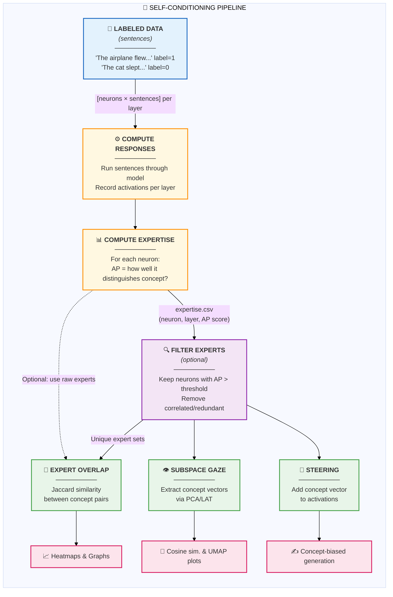

# Self-Conditioning Pipeline Overview

This document provides a visual overview of the self-conditioning analysis pipeline.

## Pipeline Diagram

### ASCII Version

```
┌─────────────────────────────────────────────────────────────────────────────┐
│                           SELF-CONDITIONING PIPELINE                        │
└─────────────────────────────────────────────────────────────────────────────┘

    ┌──────────────────┐
    │  LABELED DATA    │    "The airplane flew..." (label=1)
    │  (sentences)     │    "The cat slept..."    (label=0)
    └────────┬─────────┘
             │
             ▼
    ┌──────────────────┐
    │ COMPUTE RESPONSES│    Run sentences through model
    │                  │    Record activations per layer
    └────────┬─────────┘
             │
             │    Output: [neurons × sentences] per layer
             ▼
    ┌──────────────────┐
    │ COMPUTE EXPERTISE│    For each neuron:
    │                  │    AP = how well it distinguishes concept?
    └────────┬─────────┘
             │
             │    Output: expertise.csv (neuron, layer, AP score)
             │
             ├─────────────────────────────────────┐
             │                                     │ (optional: use raw experts)
             ▼                                     │
    ┌──────────────────┐                           │
    │  FILTER EXPERTS  │    Keep neurons with AP > threshold
    │   (optional)     │    Remove correlated/redundant neurons
    └────────┬─────────┘                           │
             │                                     │
             │    Output: Unique expert sets       │
             │                                     │
             ├─────────────────┬───────────────────┤
             ▼                 ▼                   ▼
    ┌────────────────┐ ┌────────────────┐ ┌────────────────┐
    │ EXPERT OVERLAP │ │ SUBSPACE GAZE  │ │   STEERING     │
    │                │ │                │ │                │
    │ Jaccard sim.   │ │ Extract concept│ │ Add concept    │
    │ between        │ │ vectors via    │ │ vector to      │
    │ concept pairs  │ │ PCA/LAT        │ │ activations    │
    └────────────────┘ └────────────────┘ └────────────────┘
             │                 │                 │
             ▼                 ▼                 ▼
    ┌────────────────┐ ┌────────────────┐ ┌────────────────┐
    │   Heatmaps     │ │ Cosine sim.    │ │ Concept-biased │
    │   Graphs       │ │ UMAP plots     │ │ text generation│
    └────────────────┘ └────────────────┘ └────────────────┘
```

### Mermaid Version



## Key Idea

Identify which neurons "care about" each concept (**experts**), then use them for:
- **Analysis**: Understanding concept relationships and representations
- **Generation control**: Steering text generation toward specific concepts

## Stage Descriptions

| Stage | Script | Description |
|-------|--------|-------------|
| Compute Responses | `compute_responses.py` | Run labeled sentences through model, cache activations |
| Compute Expertise | `compute_expertise.py` | Calculate Average Precision (AP) per neuron |
| Filter Experts | `filter_unique_experts.py` | Remove redundant neurons via correlation |
| Expert Overlap | `analyze_expert_overlap.py` | Compute Jaccard similarity between concepts |
| Subspace Gaze | `subspace_gaze.py` | Extract concept vectors using PCA/LAT |
| Steering | `steering_validation.py` | Validate concept vectors via generation |

## Data Flow

1. **Input**: Sentences labeled by concept (e.g., "airplane" sentences vs. others)
2. **Activations**: `[neurons × sentences]` matrix per layer
3. **Expertise**: `expertise.csv` with AP scores per neuron
4. **Experts**: Subset of neurons with AP > threshold (e.g., 0.5)
5. **Output**: Visualizations, concept vectors, or steered generations

